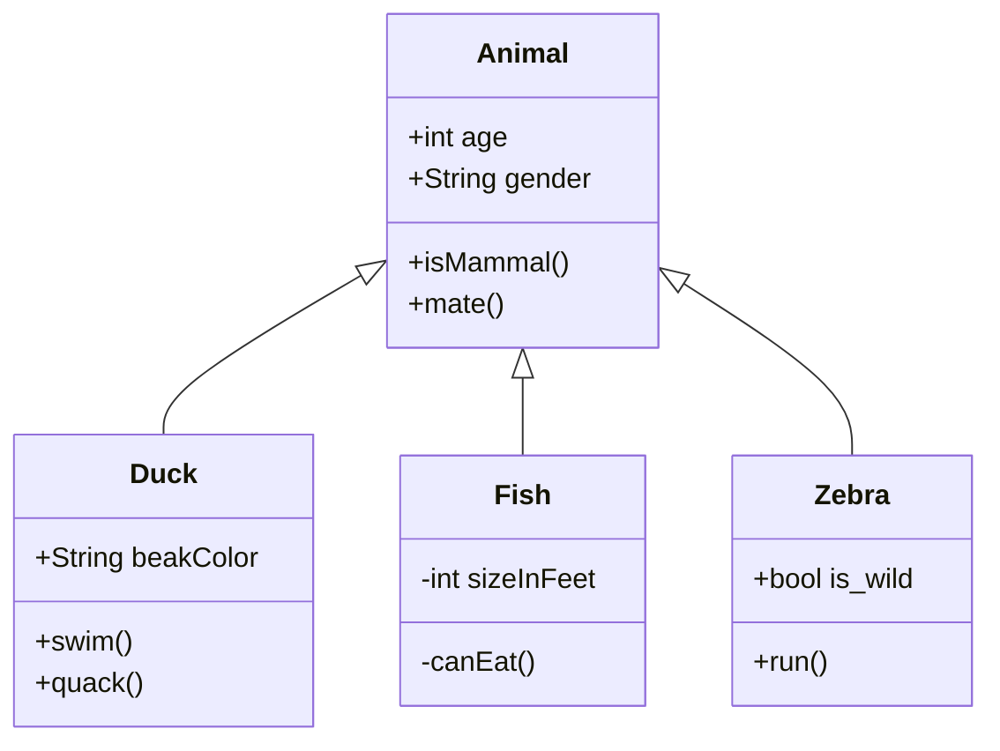
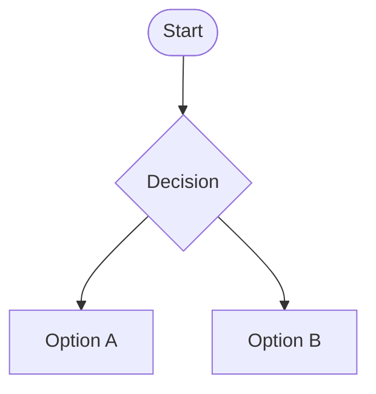
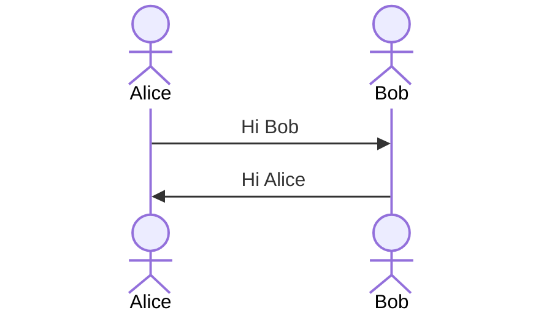

# Design Specification

## Project Overview
Provide a brief overview of the project, including its purpose, goals, and objectives.
Just a generic link to an image 

## Requirements
### Functional Requirements
List and describe the functional requirements of the project.

### Non-Functional Requirements
List and describe the non-functional requirements of the project.

## Design
### Architecture
Describe the overall architecture of the project, including diagrams if necessary.

### Flow Chart Template

### Sequence Diagram Template

### Components
List and describe the main components of the project.

### Data Model
Provide a data model for the project, including diagrams if necessary.

## Implementation
### Technologies
List and describe the technologies that will be used in the project.

### Tools
List and describe the tools that will be used in the project.

## Testing
### Test Plan
Describe the test plan for the project, including the types of tests that will be performed.

### Test Cases
List and describe the test cases for the project.

## Deployment
### Deployment Plan
Describe the deployment plan for the project, including the environments and steps required.

### Rollback Plan
Describe the rollback plan in case of deployment failure.

## Maintenance
### Monitoring
Describe how the project will be monitored after deployment.

### Updates
Describe the process for updating the project after deployment.

## Appendix
Include any additional information or references here.
