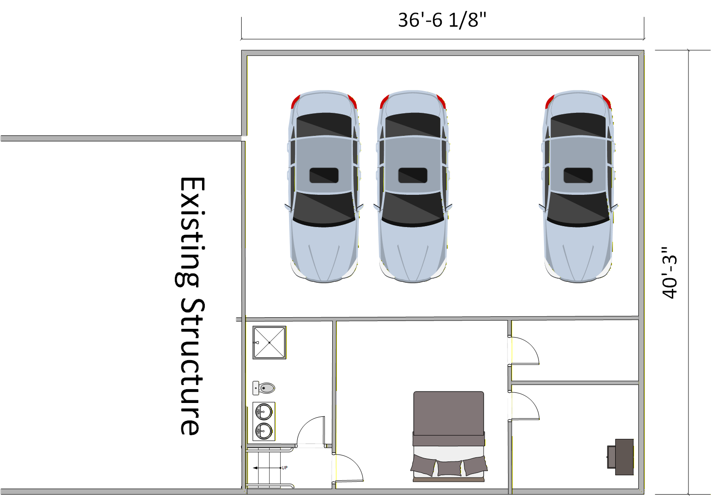
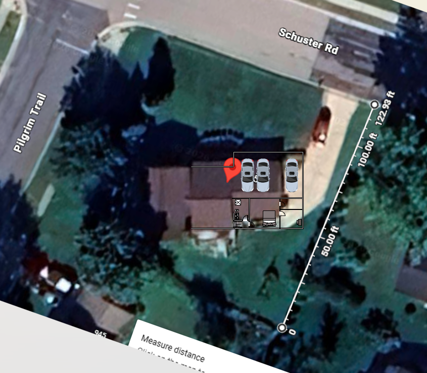

# Estimate 1

## Estimate Overview
Remodel and add on to 965 Pilgrim to meet our needs.  Remove the existing garage and driveway.  Build a new larger garage with a bedroom and bathroom
- Three Car Garage
- Bathroom
- Bedroom
- Office

### New Garage Overview

### New Garage Satellite View

## Items to be estimated
### Surveying, Detailed Design, Permitting
### Removal of existing garage and Driveway
### New Slab
### New Driveway and walkway to front door
### Structure
### Plumbing
### Electrical
### HVAC
### Interior Finishes (excluding bathrom)
### Bathroom Finishes

## Considerations
- The garage is pushing out the front to comply with setback compliances in Sun Prairie.  10 feet from the side lot and 30' from the street.  This footprint is close and will require detailed surveying and compliance review.
- Review this document from the city [ETZ_Chapter_6_Bulk_Regulations_(PDF)_201411181342505009.pdf](./../Appendix/ETZ%20Chapter%206%20Bulk%20Regulations%20(PDF)_201411181342505009.pdf)
- There is a sewer stack and a hot and cold water on the east side for the existing house.

