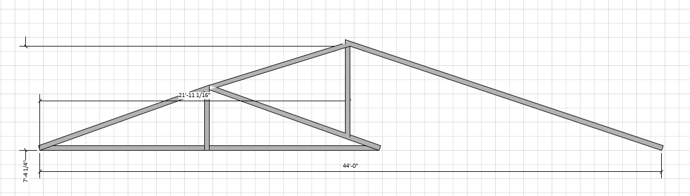

# Estimate 2

## Estimate Overview
Add an addition with a bedroom and bathroom behind the garage
- Bathroom
- Bedroom / Office

### Addition Overview

### Addition Satellite View

## Items to be estimated
### Surveying, Detailed Design, Permitting
### Plumbing
The drain / sewer and waterlines to the new bathroom area

### New Slab
 Slab should accomodate 20 x 24 foot addition on the south side or the existing garage.

### Structure
- 20 x 24 foot walls
- exterior wrap
- roof structure and shingles to match existing
- insulation, drywall

### Electrical
Running new electrical to all structure

### HVAC
- Run new ductwork to the addition

### Bathroom Finishes
- Vanity, sink, toilet, shower, tile, paint, trim, doors, windows

### Interior Finishes (excluding bathrom)
-Flooring, paint, trim, doors, windows

### Walkway to front door
-three foot wide walkway to the front door from the driveway
-new stairs to the front door

### patio in the back
Cement patio in the back of the house for entertaining and grilling.  12 x 12 foot area with a grill pad and seating area, and a place for a fire pit.

## Considerations
- There is a sewer stack and a hot and cold water on the east side for the existing house.
- What about roof pitch if we keep the existing garage?  The addition was reduced to 20 x 24 so the roof tie in can use 24 foot rafters and keep the same pitch as the existing garage.   
- Where do I move the water heater exhaust, dryer vent and new furnace exhaust?
- where should I put HVAC condenser?

