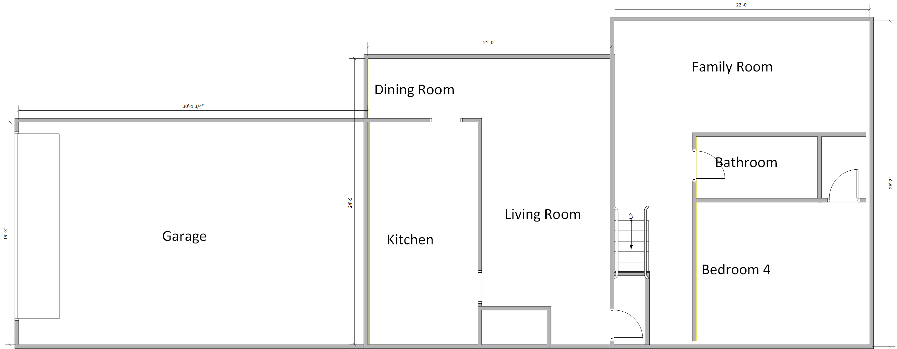
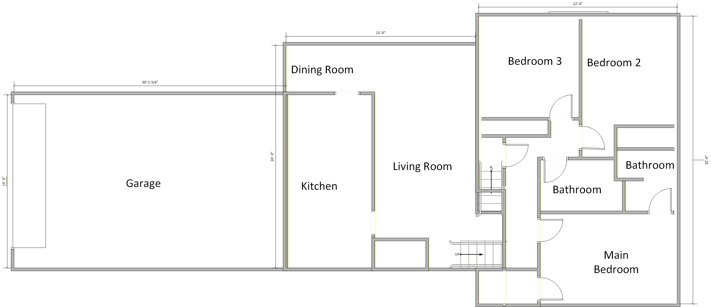
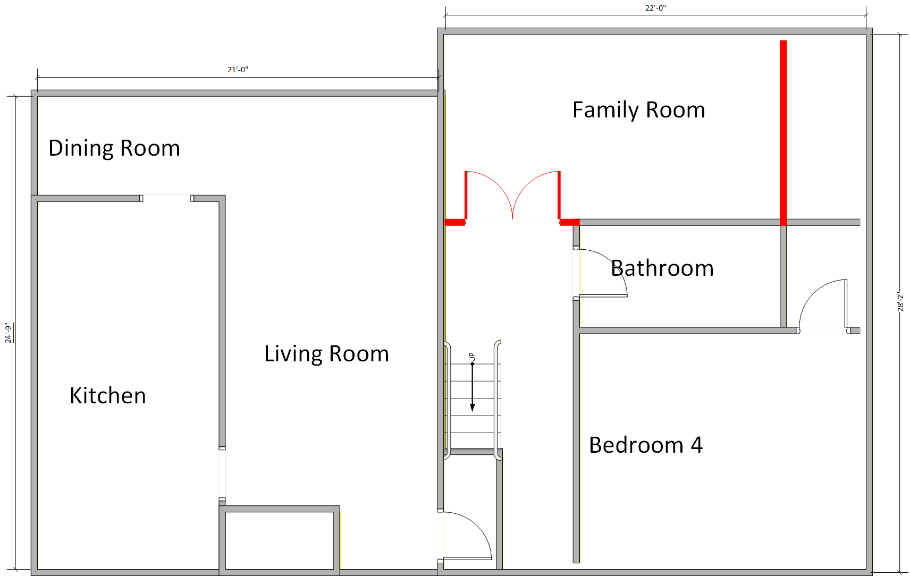
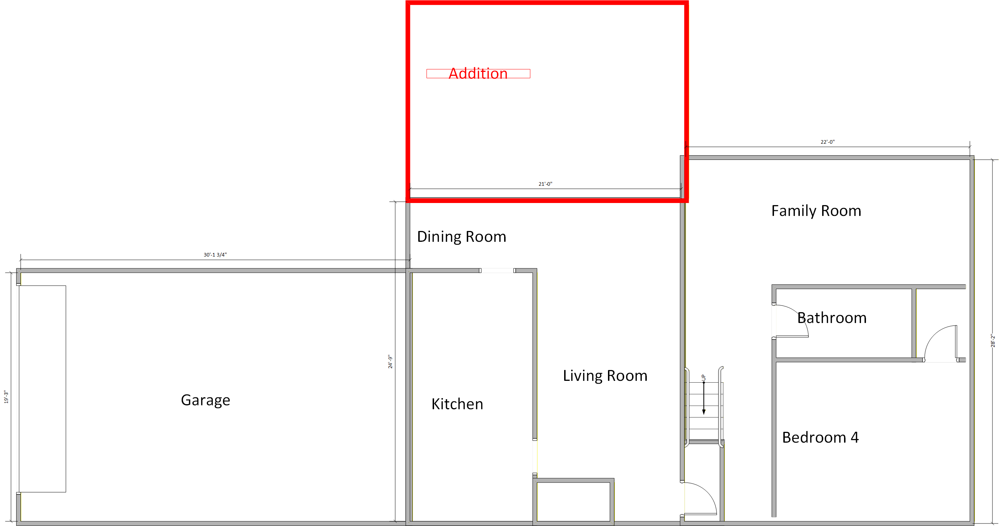
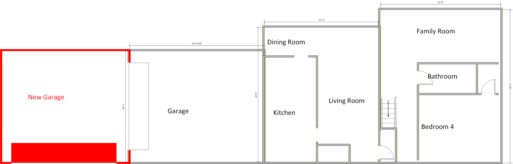
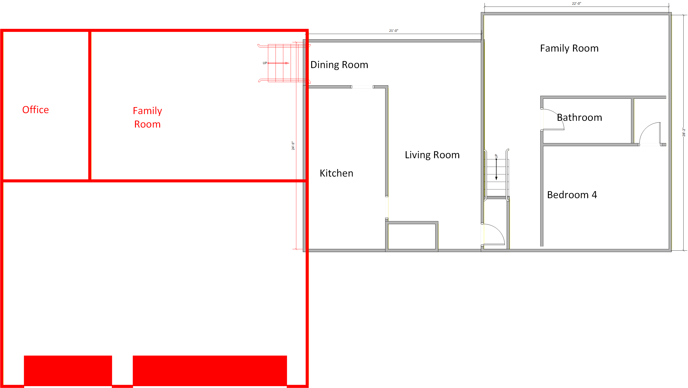
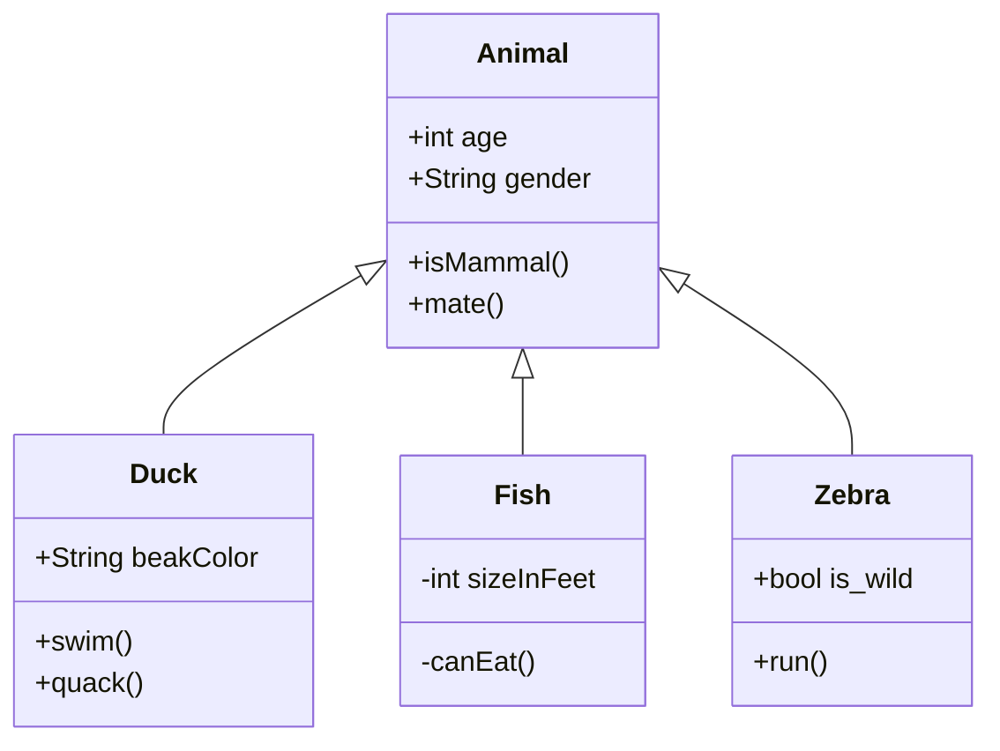
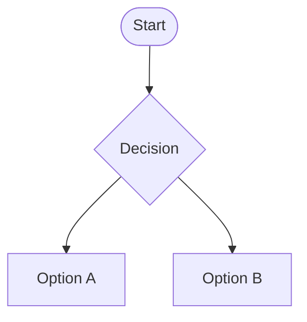
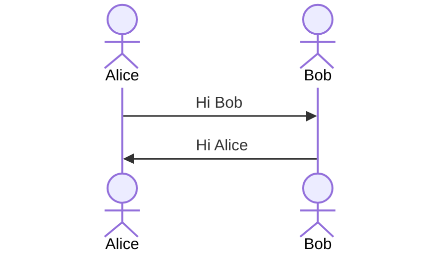

# Design Specification

## Project Overview
Remodel and add on to 965 Pilgrim to meet our needs.  Current rendering of the houses floor plan is shown here.  The dimensions are very rough and only for ideation 

### Tri-level showing lower level

### Tri-level showing upper level

## Design ideas
### Add a wall in the lower level family room -> bedroom 5

- Will this affect listing of the house as a 4 bedroom?
- Can we add a clost to the west wall of the new bedroom to make it more functional?
- Can we make the door large so it looks roomier with the door is open?
- Family loses a fireplace and an entertainment room

### Addition to the main level
Remove the deck and add on to the main level.

- What about the gas line?
- Can this be on a slab with radiant floor heating?
- How do we add the office?
- Can we just have one large living / family room instead of two separate rooms?
- Can we have a patio to the east of the addition to make up for the loss of the deck?
- What about the chimney?

### Addition to the garage eastward

Expand / add a new garage to the east of the existing garage.  The new garage would open to the north.  The old garage space would be converted to a living space.

- How close can be come to the lot line?
- Would it be better to tear down the existing garage and build a new larger garage in the same spot?

### New garage that is bigger

Build a new garage that is bigger than the existing garage.  It would open to the north and be a three car garage.  behind the garage would be a room and an office

### Flow Chart Template

### Sequence Diagram Template

### Components
List and describe the main components of the project.

### Data Model
Provide a data model for the project, including diagrams if necessary.

## Implementation
### Technologies
List and describe the technologies that will be used in the project.

### Tools
List and describe the tools that will be used in the project.

## Testing
### Test Plan
Describe the test plan for the project, including the types of tests that will be performed.

### Test Cases
List and describe the test cases for the project.

## Deployment
### Deployment Plan
Describe the deployment plan for the project, including the environments and steps required.

### Rollback Plan
Describe the rollback plan in case of deployment failure.

## Maintenance
### Monitoring
Describe how the project will be monitored after deployment.

### Updates
Describe the process for updating the project after deployment.

## Appendix
Include any additional information or references here.
